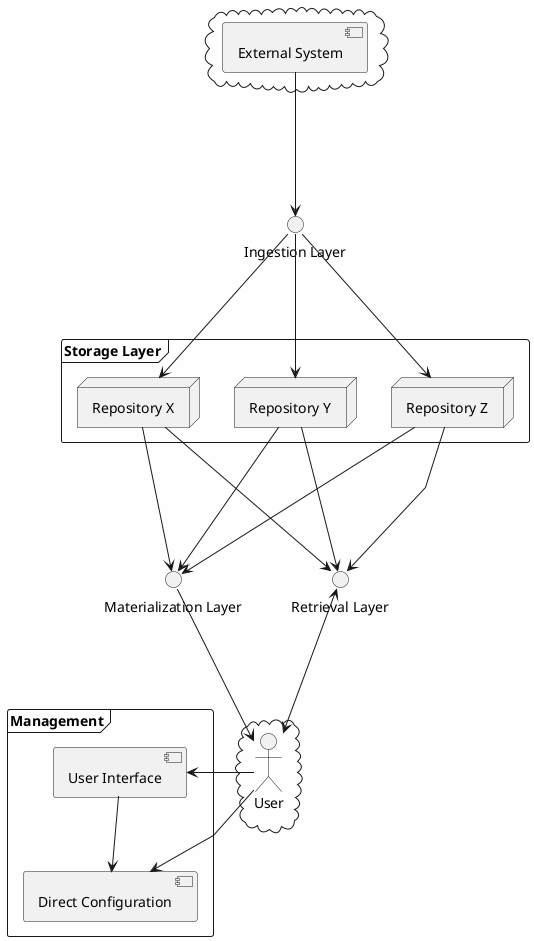

# Architecture

The CDL consists of six layers, each horizontally scalable and replaceable.

## Management Layer

### Tools / UI
| Crate Name  | Purpose                                                                                                       |
|-------------|---------------------------------------------------------------------------------------------------------------|
| [cli]       | Provides a command-line interface for managing schemas in the schema registry and storing and retrieving data |
| [web-admin] | Admin Web Panel - provides GUI interface for managing schemas and storing and retrieving data                 |
| [API]       | used as a backend service for web-admin, provides unified interface to manage CDL.                            |

### Direct Configuration
| Crate Name        | Purpose                                                                                           |
|-------------------|---------------------------------------------------------------------------------------------------|
| [edge-registry]   | Store and manage schema and object relations (for materialization purposes)                       |
| [schema-registry] | Manage user-defined schemas that define the format of incoming values and their respective topics |

## Ingestion Layer
| Crate Name    | Purpose                                                                                 |
|---------------|-----------------------------------------------------------------------------------------|
| [data-router] | Route incoming data from and through MQ for consumption by the specific Command Service |

## Storage Layer
Storage layer, which is sometimes called "repository".

| Crate Name            | Purpose                                                 |
|-----------------------|---------------------------------------------------------|
| [query-service]       | Wrap each individual database for retrieval of data     |
| [command-service]     | Intake data from a MQ and storage, in specific database |
| [db-shrinker-storage] | A service to remove older data from storage             |

## Materialization Layer
Internal layer which materializes views

| Crate Name              | Purpose                                                                                                      |
|-------------------------|--------------------------------------------------------------------------------------------------------------|
| [object-builder]        | Responsible for fetching data from various repositories and joining it together                              |
| [partial-update-engine] | Responsible for reading command-service notifications and sending materialization requests to object builder |
| [materializer-general]  | Responsible for materializing data on the fly into database                                                  |
| [materializer-ondemand] | Responsible for materializing data on demand without saving results in any database                          |

## Retrieval Layer
| Crate Name     | Purpose                                                     |
|----------------|-------------------------------------------------------------|
| [query-router] | Route incoming requests to query service based on schema id |

## Additional crates
| Crate Name | Purpose                                                                          |
|------------|----------------------------------------------------------------------------------|
| rpc        | A collection of GRPC proto files and automatically generated client/server code. |
| utils      | A collection of utilities used throughout the Common Data Layer                  |

## Useful directories

| Directory          | Purpose                                               |
|--------------------|-------------------------------------------------------|
| deployment/helm    | helm charts for kubernetes deployment                 |
| xtask              | utility tool to generate code from rpc proto schemas  |
| benchmarking       | scripts and scaffolding data for benchmarking         |
| tests              | component tests                                       |
| examples           | exemplary client of cdl                               |
| docs               | cdl documentation                                     |

[cli]: cli.md

[web-admin]: web_admin.md

[API]: api.md

[edge-registry]: ./edge_registry.md

[schema-registry]: schema_registry.md

[data-router]: data_router.md

[query-service]: query_service.md

[command-service]: command_service.md

[db-shrinker-storage]: db_shrinker_storage.md

[query-router]: query_router.md

[object-builder]: object_builder.md

[partial-update-engine]: partial_update_engine.md

[materializer-general]: materializer_general.md

[materializer-ondemand]: materializer_ondemand.md
